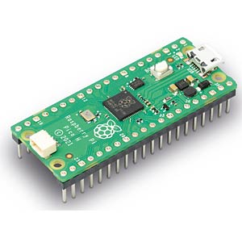

# 🪁 zephyr-rs 🦀

 

    

 

A Zephyr module that will allow to write Zephyr apps in Rust. This project is for educational and explorative purposes only.

 

The following examples are provided as so called
[Zephyr freestanding applications](https://docs.zephyrproject.org/latest/develop/application/index.html#zephyr-freestanding-application)

- [blinky](./examples/blinky/) - Zephyr Blinky App for testing purposes
- [hello-world](./examples/hello-world/) - Minimal Zephyr Rust App

 

## Hardware

The only supported architecture is [Arm Cortex-M0+](https://developer.arm.com/Processors/Cortex-M0-Plus)
using a [(Armv6-M)](https://developer.arm.com/documentation/ddi0419/latest/) ISA. The only supported board is the
[Raspberry Pi Pico](https://www.raspberrypi.com/products/raspberry-pi-pico/). For quality of life reasons,
make sure you get the [Debug Probe](https://www.raspberrypi.com/products/debug-probe/) as well.

 

    

 

## Console

`screen -L /dev/tty.usbmodemxxx 115200 -L`

Quit with `Ctrl-A + Ctrl-\`

<b>🚧 zephyr-rs is under construction - a hardhat 👷 is recommended beyond this point 🚧</b>

